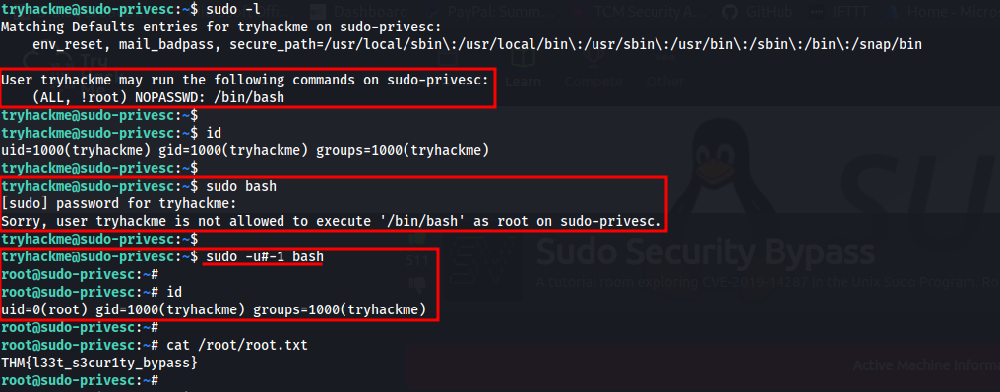

#Phases/Methodology #PrivEsc 

# Sudo

### Shell Escaping
Some binaries are capable of spawning new shell instances. When those same binaries are run with escalated privileges, shell instance will also be created with escalated privileges.

This can happen when the said binaries are available for low-level users to "sudo" without passwords or due to the SUID bit being set on that binary, being identified as general misconfigurations.

- [GTFOBins](https://gtfobins.github.io) - Curated list of Unix binaries that can be used to bypass local security restrictions in misconfigured systems.

### Intended Functionality
Not all binaries are capable of executing commands or shell escaping. Instead it may be abused for its actual functionality along with "sudo".

Example: `wget` can be used to "GET" and "POST" files. If by any chance, `wget` can be executed with "sudo" on a low-level user, it can be used to post sensitive files to a listening server where the contents of the file can viewed.

### LD_PRELOAD
[Abusing LD_PRELOAD for privilege escalation](https://whitecr0wz.github.io/posts/LD_PRELOAD/)

### Sudo Security Bypass (CVE-2019-14287)
Affects versions < 1.8.28
- [TryHackMe](https://tryhackme.com/room/sudovulnsbypass)
- [Exploit Database](https://www.exploit-db.com/exploits/47502)

Basically:

*It is possible to impersonate any user with this CVE*.

### Sudo Buffer Overflow
Affects versions < 1.8.26
- [TryHackMe](https://tryhackme.com/room/sudovulnsbof)
- [GitHub](https://github.com/saleemrashid/sudo-cve-2019-18634)

