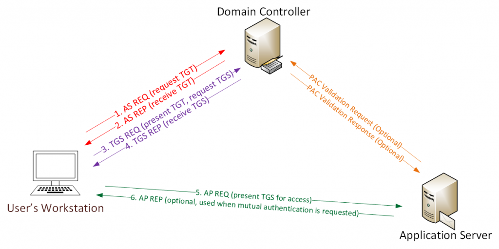

#Active-Directory #Post-Exploitation 

# Kerberoasting

"**Kerberoasting** abuses traits of the [Kerberos](https://stealthbits.com/blog/what-is-kerberos/) protocol to harvest password hashes for Active Directory user accounts with _ServicePrincipalName (SPN)_ values (i.e. service accounts). A user is allowed to request a _ticket-granting service (TGS)_ ticket for any SPN, and parts of the TGS may be encrypted with the with RC4 using the password hash of the service account assigned the requested SPN as the key."

"An adversary who is able to extract the TGS tickets from memory, or captures them by sniffing network traffic, can extract the service account’s password hash and attempt an offline brute force attack to obtain the plaintext password."

-> *[Kerberoasting - Stealthbits Attack Catalog](https://attack.stealthbits.com/cracking-kerberos-tgs-tickets-using-kerberoasting)*


-> *[Detecting Kerberoasting Activity - AD Security](https://adsecurity.org/?p=3458)*

### Tools:
- [Original powershell implementation](https://github.com/nidem/kerberoast) of attacking Kerberos.
- [Python implementation](https://github.com/skelsec/kerberoast) of the same tool that is also integrated into "Impacket" suite.


### Kerberoasting with Impacket
This attack is possible to carry out with any valid domain credentials regardless of their privileges.

``` shell
> GetUserSPNs <domain>/<user>:<password> -dc-ip -request # Requesting the TGS with server hash associated with user's account
> ..
> hashcat -m 13100 <hash> <wordlist> # Attempt offline bruteforcing
> ..
```

Service accounts can have varying capabilities and can be used to authenticate into the domain as well. Poorly configured service accounts can give a threat actor unintentional foothold with privileged access.

### Defensive measures
- Strong passwords
- Least privilege (Service accounts should not be domain admins)

